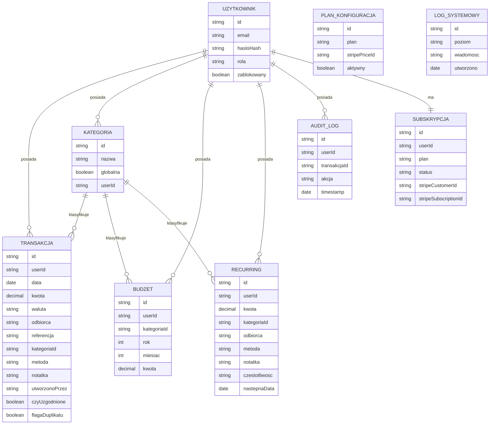

# ERD – FinSync

```mermaid
erDiagram
  UZYTKOWNIK ||--o{ TRANSAKCJA : posiada
  UZYTKOWNIK ||--o{ KATEGORIA : posiada
  UZYTKOWNIK ||--o{ BUDZET : posiada
  UZYTKOWNIK ||--o{ RECURRING : posiada
  UZYTKOWNIK ||--o{ AUDIT_LOG : posiada
  UZYTKOWNIK ||--|| SUBSKRYPCJA : ma
  KATEGORIA ||--o{ TRANSAKCJA : klasyfikuje
  KATEGORIA ||--o{ BUDZET : klasyfikuje
  KATEGORIA ||--o{ RECURRING : klasyfikuje

  UZYTKOWNIK {
    string id
    string email
    string hasloHash
    string rola
    boolean zablokowany
  }
  TRANSAKCJA {
    string id
    string userId
    date data
    decimal kwota
    string waluta
    string odbiorca
    string referencja
    string kategoriaId
    string metoda
    string notatka
    string utworzonoPrzez
    boolean czyUzgodnione
    boolean flagaDuplikatu
  }
  KATEGORIA {
    string id
    string nazwa
    boolean globalna
    string userId
  }
  BUDZET {
    string id
    string userId
    string kategoriaId
    int rok
    int miesiac
    decimal kwota
  }
  RECURRING {
    string id
    string userId
    decimal kwota
    string kategoriaId
    string odbiorca
    string metoda
    string notatka
    string czestotliwosc
    date nastepnaData
  }
  AUDIT_LOG {
    string id
    string userId
    string transakcjaId
    string akcja
    date timestamp
  }
  SUBSKRYPCJA {
    string id
    string userId
    string plan
    string status
    string stripeCustomerId
    string stripeSubscriptionId
  }
  PLAN_KONFIGURACJA {
    string id
    string plan
    string stripePriceId
    boolean aktywny
  }
  LOG_SYSTEMOWY {
    string id
    string poziom
    string wiadomosc
    date utworzono
  }
```

